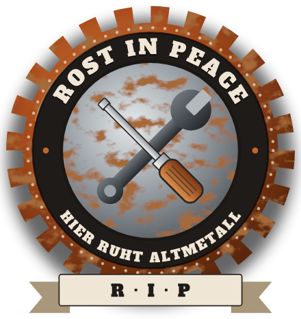
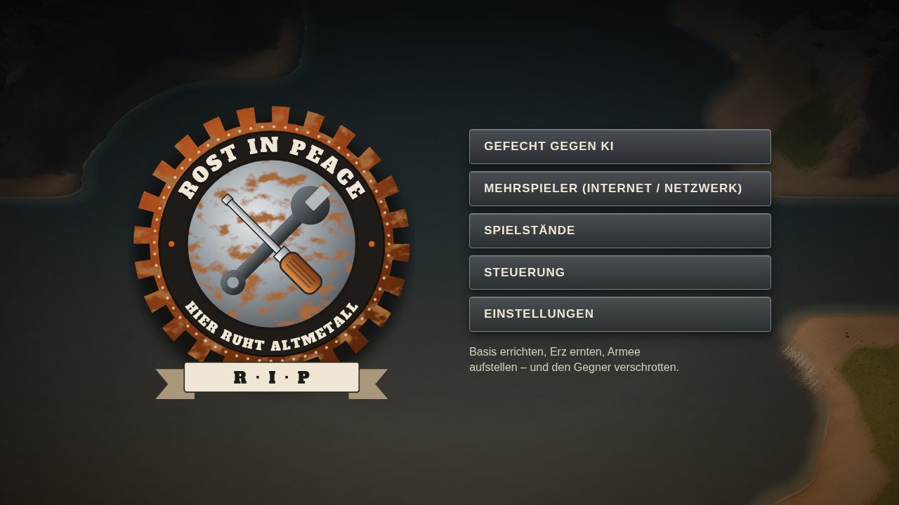
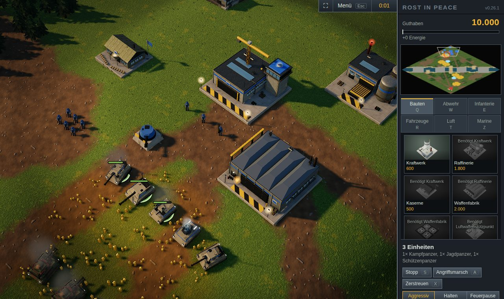

# Rost in Peace – Download

*Hier ruht Altmetall.* Echtzeit-Strategie für Windows: Basis bauen, Erz sammeln, Armeen ausheben – und den Gegner
verschrotten. Zwei Fraktionen (Allianz und Pakt) mit eigenen Einheiten, Panzer, Infanterie, Flugzeuge und Schiffe,
16 Karten und Zufallskarten, Gegner in vier Stärken und Mehrspieler im Netzwerk. Läuft vollständig offline,
ohne Browser.

**[⬇ Neueste Version herunterladen](../../releases/latest)**

## Installieren

1. Unter **[Releases → neueste Version](../../releases/latest)** bei „Assets“ die Datei
   `RostInPeace-Setup-x.y.z.exe` herunterladen.
2. Doppelklicken. Windows zeigt beim ersten Mal eventuell „Der Computer wurde durch Windows geschützt“, weil das
   Setup nicht digital signiert ist: **Weitere Informationen → Trotzdem ausführen**.
3. Installationsordner bestätigen – Administratorrechte sind nicht nötig. Danach liegt Rost in Peace im Startmenü
   und auf dem Desktop.

**Voraussetzungen:** Windows 10 oder 11 (64 Bit) und eine Grafikkarte mit WebGL 2 – praktisch jeder PC ab etwa 2015
mit aktuellem Treiber. Ruckelt es, hilft *Einstellungen → Effekte: Niedrig*.

## Updates

Beim Start sucht das Spiel nach einer neuen Version, zeigt die Neuerungen aller Versionen seit der installierten
und fragt, ob sie geladen werden soll. Der Hinweis kommt bei jedem Start wieder, bis das Update installiert ist.
Installiert wird beim Neustart oder beim Beenden – nie während einer Partie. Spielstände und Einstellungen bleiben
erhalten. Abschalten lässt sich die Suche unter **Einstellungen → Beim Start nach Updates suchen**.

**Testversionen:** Neue Versionen erscheinen hier zuerst als „Pre-release“ mit dem Zusatz „Testversion“ und werden
nach dem Ausprobieren für alle freigegeben. Wer sie früher haben möchte, schaltet im Spiel
**Einstellungen → Testversionen erhalten** ein. Testversionen können noch Fehler enthalten.

**Version 0.26.1 oder älter installiert?** Diese Versionen finden keine Updates mehr. Einfach einmal das neue Setup
herunterladen und installieren – es ersetzt die alte Version, Spielstände und Einstellungen bleiben erhalten. Danach
kommen Updates wieder von selbst.

## Deinstallieren

Über **Windows-Einstellungen → Apps → Rost in Peace → Deinstallieren**. Dabei fragt das Spiel, ob Spielstände und
Einstellungen ebenfalls gelöscht werden sollen; ohne Zustimmung bleiben sie erhalten und stehen nach einer neuen
Installation wieder zur Verfügung.

## Datenschutz

Das Spiel sammelt und sendet keine Daten. Es verbindet sich nur mit GitHub, um nach Updates zu suchen (abschaltbar,
siehe oben), und im Mehrspieler mit dem Server oder PC, den man selbst auswählt.

## Herkunft

Grafik, Modelle, Karten und Klänge werden vom Spiel selbst erzeugt; es enthält keine Inhalte anderer Spiele.
Die Stimmen sind mit der Sprachausgabe [Piper](https://github.com/OHF-Voice/piper1-gpl) aus gemeinfreien Aufnahmen
(CC0) von [Thorsten-Voice](https://github.com/thorstenMueller/Thorsten-Voice) und
[dataset-voice-kerstin](https://github.com/rhasspy/dataset-voice-kerstin) erzeugt. Die 3D-Darstellung nutzt
[three.js](https://threejs.org) (MIT-Lizenz), die Windows-Fassung [Electron](https://www.electronjs.org) (MIT-Lizenz).

Dieses Repository enthält nur die fertigen Downloads; sie werden automatisch veröffentlicht.
Bis Version 0.21 hiess das Spiel „Stahlsturm“.
